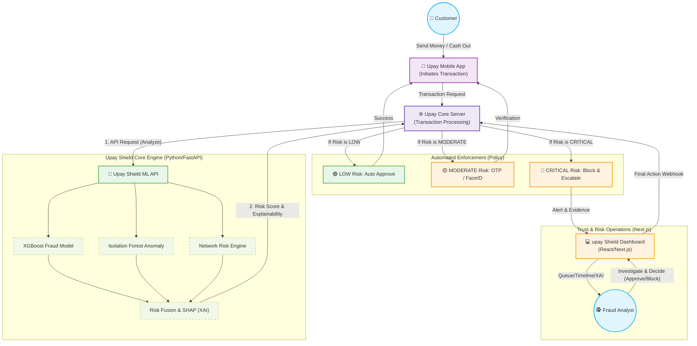

# upay Shield: Trust & Risk Intelligence 🛡️

*Track 01: Trust & Risk Intelligence | Team: Ma Babar Doua (Nahid, Farhan, Rakib)*

upay Shield turns transaction risk signals into explainable, investigation-ready intelligence.
**Detect the risk. Understand why. Investigate the evidence. Decide with confidence.**

---

## 🔗 Live Deployment URL
**Frontend UI (Vercel):** [https://diu-hacakthonmababardoua.vercel.app/](https://diu-hacakthonmababardoua.vercel.app/)
**Backend API (Render):** [https://upayshield-api.onrender.com/health](https://upayshield-api.onrender.com/health)
*(Note: As the backend is hosted on a free Render tier, the first API request may take up to 50 seconds to wake up the server. Please be patient during the first test.)*

---

## 1. Project Overview
upay Shield is an AI-assisted decision-support prototype designed to enhance financial Trust & Risk Operations. Rather than simply blocking transactions in a vacuum, the system provides a multi-layer view of risk and directly connects machine learning inference to human-in-the-loop investigation workflows.

## 2. Problem
Traditional rule-based financial security systems flag too many false positives and lack explainability (the "Black Box" problem). Fraud analysts waste significant time hunting for evidence across fragmented systems during increasingly sophisticated attacks like Account Takeovers (ATO) and coordinated Mule Networks.

## 3. Solution
A unified intelligence platform that fuses supervised and unsupervised machine learning to detect fraud, explains its reasoning via feature attribution, and pipes structured evidence directly into a built-in Investigation Workbench for human analysts.

## 4. Why AI/ML?
Modern threats evolve faster than static rules can adapt. AI/ML enables the platform to detect subtle behavioral deviations (unsupervised learning) and recognize historically complex fraud patterns (supervised learning) across massive volumes of synthetic transaction data, surfacing priority cases instantly.

## 5. Architecture
The prototype architecture is decoupled and designed for future integration via APIs.



**Workflow Summary:**
**Next.js Frontend UI** ⇆ REST API ⇆ **Python/FastAPI ML Backend** 

## 6. ML Models (Risk Fusion)
- **XGBoost (Supervised):** Synthetic typologies classifier identifying known transaction fraud patterns.
- **Isolation Forest (Unsupervised):** Behavioral anomaly engine detecting unexpected deviations from a user's baseline.
- **Graph Risk Engine:** Heuristic network risk logic analyzing velocity and counterparty connections.

## 7. Explainability (XAI)
To counter the "black box" problem, upay Shield utilizes **SHAP (SHapley Additive exPlanations)**. Once a risk score is generated, the UI dynamically displays the top risk-driving factors—proving to analysts exactly *why* the AI flagged the transaction.

## 8. Investigation Workflow
The system actively supports human oversight:
**Transaction Detected → ML Risk Assessed → SHAP Explanation Generated → Investigation Opened → Analyst Case Review**

## 9. Business Impact
*Metrics represent simulated prototype estimates.*
By gathering structured evidence and providing clear AI-assisted triage, the platform highlights the potential to significantly reduce analyst investigation time (Estimated Equivalent Hours Saved) and prioritize critical operational focus where human attention is most needed.

## 10. Responsible AI
upay Shield is developed around ethical AI principles:
- **No autonomous consequential decisions:** Financial interventions are mapped as recommendations for human review.
- **Human-in-the-loop:** The system accelerates analysts; it does not replace them.
- **Privacy-first approach:** Separation of inference and interface.

## 11. Synthetic Data
To ensure safety and privacy, the prototype was developed entirely on **synthetic data models**. No real customer PII or production transaction data was processed or embedded in this prototype.

## 12. Demo Flow (How to Test)
1. **Explore the Simulator:** Open the *Architecture & Ethics* tab to view the system overview, then navigate to the *Real-time Analysis Simulator*.
2. **Trigger Scenarios:** Click the preset scenario buttons (e.g., NORMAL, ATO / SIM-SWAP). Click **"Analyze Transaction"**.
3. **Analyze & Explain:** Observe the AI Trust Architecture in action as the Final Risk Score adjusts, SHAP visualization renders, and the structured intelligence narrative is generated.
4. **Open Investigation:** Click the button to inspect the generated evidence chain and human review roadmap.
5. **Review ROI:** Switch to the *Business Impact & ROI* tab to see dynamically simulated efficiency gains.

## 13. Tech Stack
- **Frontend UI:** Next.js (React), Tailwind CSS v4, TypeScript, Hosted on Vercel.
- **Backend Inference API:** Python, FastAPI, Uvicorn, Hosted on Render.
- **Data & ML Libraries:** Pandas, NumPy, scikit-learn, XGBoost, SHAP.

## 14. Local Setup
```bash
# 1. Clone
git clone https://github.com/Md-NahidHassan/DIU-Hacakthon.git
cd DIU-Hacakthon

# 2. Frontend
npm install
# Create .env.local -> NEXT_PUBLIC_API_URL=http://localhost:8005

# 3. Backend (Separate terminal)
cd ml
pip install -r requirements.txt
python inference/main.py

# 4. Run UI
npm run dev
```

## 15. Prototype Limitations
- Operations execute completely within a synthetic data environment and display synthetic validation metrics.
- The prototype does not evaluate production upay transaction data.
- The system is an architectural prototype; there are no production fraud-loss prevention claims.

## 16. Future Validation Path
**Current:** Synthetic Validation → **Next:** Controlled Historical Validation with Approved Data → **Pilot:** Human-Reviewed Shadow Mode → **Goal:** Monitored Integration with Operational Controls
